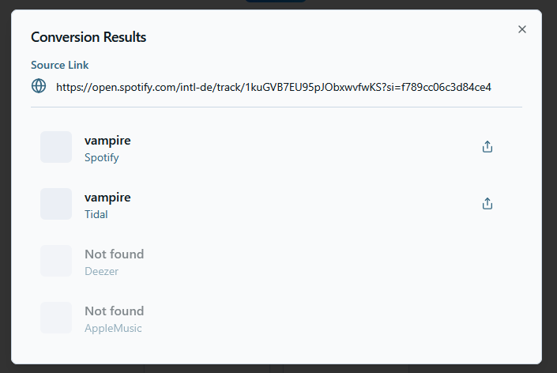

# 🎵 Interlude (Web) Client

<!-- App-Icon -->

  

## 📝 Description
**Interlude** is a simple and user-friendly app for converting and sharing music links across different streaming platforms.  
Paste a link to a song or album (from Spotify, Apple Music, YouTube, etc.), and Interlude automatically finds and generates matching links for other popular music services.  

---

## ✨ Key Features
- *Multi-Platform Support*: Works with Spotify, Apple Music, Tidal, Deezer (and more planned).  
- *Automatic Conversion*: Paste a single link, get matching links for other platforms.  
- *Universal Sharing*: Share music without worrying about which app your friends use.  
- *Cross-Device*: Works smoothly on mobile and desktop browsers.  
- *Simple UI*: Clean, lightweight, and user-friendly interface.  

---

## 🚀 Development Status
- [x] Core features functional  
- [ ] Service coverage expansion (more platforms)

---

## 🖼️ Screenshots
<!-- Replace with actual paths to your screenshots -->

---

## 🌐 Links
- [🌍 Official Website]([https://interlude.leshift.de/])  
- [🌍 Android and iOS Code]([https://github.com/LS-Studios/Interlude-Mobile-Client)
- [📖 Backend Code]([https://github.com/antoniomikley/interlude_server])

---

## 🛠️ Technology
- **Frontend Mobile**: Compose Multiplatform (Android & iOS)
- **Frontend Web**: NextJS & TypeScript
- **Backend**: Rust  

---

## 👤 Developer
| Name          | Role                  | GitHub                                        |
|---------------|-----------------------|-----------------------------------------------|
| Lennard Stubbe | Frontend Development  | [@LS-Studios](https://github.com/LS-Studios)          |
| Nick Schefner  | Backend Development   | [@ItsJuzoSuzuya](https://github.com/ItsJuzoSuzuya)      |
| Antonio Mikley | Backend Development   | [@antoniomikley](https://github.com/antoniomikley) |

---

## ⚖️ License
This project is licensed under the **MIT License**.  
See [LICENSE](LICENSE) for details.
